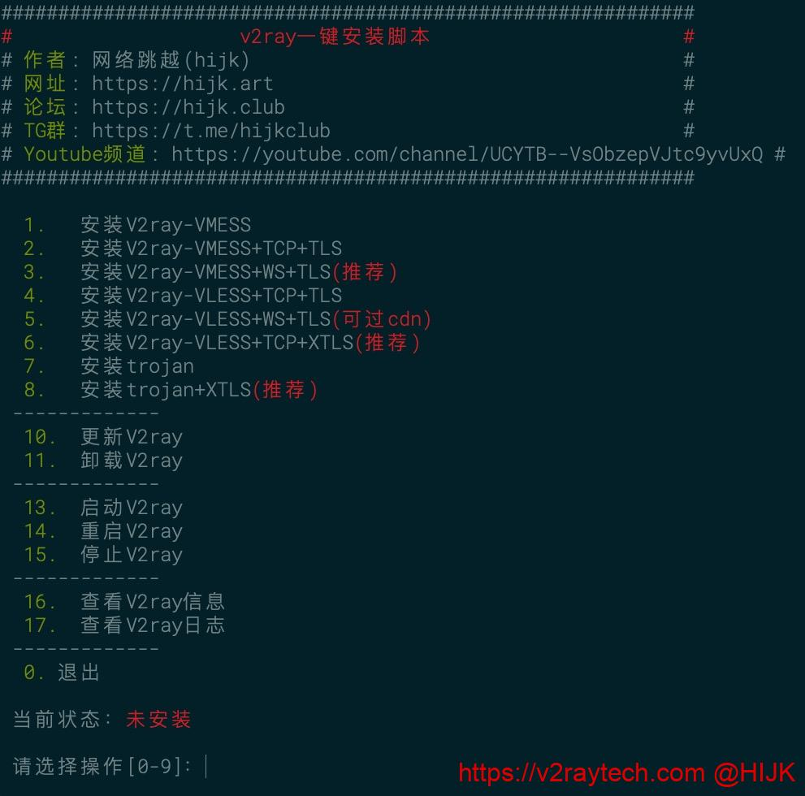
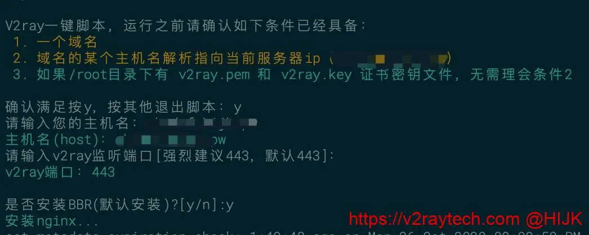
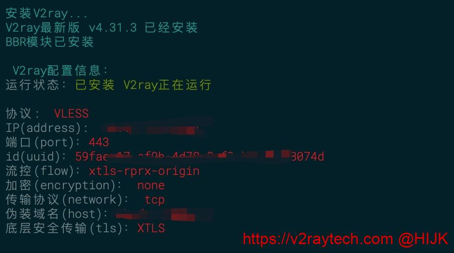

<blockquote>
使用过程中遇到问题，欢迎到 <a href="https://hijk.club" target="_blank" rel="noopener">网络跳越论坛</a> 或 tg群组<a href="https://t.me/hijkclub" target="_blank" rel="noopener nofollow">https://t.me/hijkclub</a> 交流，或关注Youtube频道：<a href="https://youtube.com/channel/UCYTB--VsObzepVJtc9yvUxQ" target="_blank" rel="noopener">网络跳越</a><strong></strong>

<strong>2020.12.05更新</strong>：最新版V2ray-core已经移除了XTLS，如果你要使用XTLS技术，推荐 <a href="https://v2raytech.com/xray-one-click-script/" target="_blank" rel="noopener">Xray一键脚本</a>
</blockquote>
作为合格的打工人(<del>搬砖工</del><a href="https://v2raytech.com/bandwagonghost-buy-vps-tutorial/" target="_blank" rel="noopener">搬瓦工</a>)，每天累趴回家必须要先躺尸一下，顺便看看<a href="https://imeizi.me" target="_blank" rel="noopener nofollow">小姐姐</a>恢复元气。疯狂跳票几周后，今天终于抽空把支持<a href="https://v2raytech.com/category/v2ray/" target="_blank" rel="noopener">V2ray</a>最新VLESS协议一键脚本弄完了。本次的<a href="https://v2raytech.com/tag/v2ray一键脚本/" target="_blank" rel="noopener">V2ray一键脚本</a>功能强大，支持常规VMESS协议、VMESS+websocket+TLS+Nginx、VLESS+TCP+XTLS、VLESS+TCP+TLS等多种组合，支持CentOS 7/8、Ubuntu 16.04以上、Debian 8以上系统，以及相关衍生系统。
<h2>V2ray VLESS+TCP+XTLS一键脚本</h2>
本<a href="https://v2raytech.com/tag/v2ray一键脚本/" target="_blank" rel="noopener">V2ray一键脚本</a>使用步骤如下：

1. 准备一个境外服务器，想服务器速度快请参考 <a href="https://v2raytech.com/bandwagonghost-buy-vps-tutorial/" target="_blank" rel="noopener">搬瓦工VPS购买教程</a> 或从&nbsp; <a href="https://v2raytech.com/cn2-gia-merchants/" target="_blank" rel="noopener nofollow">CN2 GIA VPS商家推荐</a> 选购，想ip被封后免费换请参考：<a class="wpp-post-title" href="https://v2raytech.com/vultr-buy-vps-tutorial/" target="_blank" rel="noopener">购买vultr服务器超详细图文教程</a>。

如果用VMESS+WS+TLS或者VLESS系列协议，则还需一个域名。对域名没有要求，国内/国外注册的都可以，<strong>不需要备案</strong>，不会影响使用，也不会带来安全/隐私上的问题。购买域名可参考：<a href="https://v2raytech.com/namesilo-buy-domain-tutorial/" target="_blank" rel="noopener noreferrer">Namesilo购买域名详细教程</a>。

值得一提的是本V2ray一键脚本支持ipv6 only服务器，但是不建议用只有ipv6的VPS用来科学上网。
<blockquote>
在NAT VPS运行本脚本请先参考：<a class="row-title" href="https://v2raytech.com/run-scripts-on-nat-vps/" aria-label="“在NAT VPS上运行本站一键脚本”（编辑）" target="_blank" rel="noopener">在NAT VPS上运行本站一键脚本</a>
</blockquote>
2. 如果vps运营商开启了防火墙（阿里云、Ucloud、腾讯云、AWS、GCP等商家默认有，搬瓦工/hostdare/vultr等商家默认关闭），请先登录vps管理后台放行80和443端口，否则可能会导致获取证书失败。此外，<strong>本脚本支持上传自定义证书</strong>，可跳过申请证书这一步，也可用在<a href="https://v2raytech.com/tag/nat-vps/" target="_blank" rel="noopener">NAT VPS</a>上。

3. ssh连接到服务器。Windows系统请参考 <a href="https://v2raytech.com/bitvise-connect-linux-server-tutorial/" target="_blank" rel="noopener noreferrer">Bitvise连接Linux服务器教程</a>，mac用户请参考 <a href="https://v2raytech.com/mac-connect-to-linux-tutorial/" target="_blank" rel="noopener">Mac电脑连接Linux教程</a>。

4. 复制（或手动输入）下面命令到终端
<pre class=" prettyprinted"><code class=" prettyprinted">bash &lt;(curl -sL https://s.hijk.art/v2ray.sh)</code></pre>
按回车键，将出现如下操作菜单。如果菜单没出现，CentOS系统请输入 <code class=" prettyprinted" style="">yum install -y curl</code>，Ubuntu/Debian系统请输入 <code class=" prettyprinted" style="">sudo apt install -y curl</code>，然后再次运行上面的命令：

V2ray一键脚本安装菜单

目前V2ray一键脚本支持以下功能：
<ul><li><strong>VMESS</strong>，即最普通的V2ray服务器，没有伪装，也不是VLESS</li><li><strong>VMESS</strong>+KCP，传输协议使用mKCP，VPS线路不好时可能有奇效</li><li><strong>VMESS</strong>+TCP+TLS，带伪装的V2ray，不能过<a href="https://v2raytech.com/use-cloudflare-unlock-blocked-ip/" target="_blank" rel="noopener">CDN中转</a></li><li><strong>VMESS</strong>+WS+TLS，即最通用的V2ray伪装方式，能过<a href="https://v2raytech.com/use-cloudflare-unlock-blocked-ip/" target="_blank" rel="noopener">CDN中转</a>，推荐使用</li><li><strong>VLESS</strong>+KCP，传输协议使用mKCP</li><li><strong>VLESS</strong>+TCP+TLS，通用的VLESS版本，不能过<a href="https://v2raytech.com/use-cloudflare-unlock-blocked-ip/" target="_blank" rel="noopener">CDN中转</a>，但比VMESS+TCP+TLS方式性能更好</li><li><strong>VLESS</strong>+WS+TLS，基于websocket的V2ray伪装VLESS版本，能过<a href="https://v2raytech.com/use-cloudflare-unlock-blocked-ip/" target="_blank" rel="noopener">CDN中转</a>，有过CDN情况下推荐使用</li><li><strong>VLESS</strong>+TCP+XTLS，目前最强悍的VLESS+XTLS组合，强力推荐使用（但是支持的客户端少一些）</li><li><strong>trojan</strong>，轻量级的伪装协议</li><li><strong>trojan</strong>+XTLS，trojan加强版，使用XTLS技术来提升性能</li></ul><blockquote>
注意：目前一些客户端不支持VLESS协议，或者不支持XTLS，请按照自己的情况选择组合
</blockquote>
5. 按照自己的需求选择一个方式。例如6，然后回车。接着脚本会让你输入一些信息，也可以直接按回车使用默认值。需要注意的是，对于要输入伪装域名的情况，<strong>如果服务器上有网站在运行</strong>，请联系运维再执行脚本，否则可能导致原来网站无法访问！

VLESS+TCP+XTLS一键脚本输入信息

6. 脚本接下来会自动运行，一切顺利的话结束后会输出配置信息：

VLESS+TCP+XTLS一键脚本输出信息

<strong>到此服务端配置完毕</strong>，服务器可能会自动重启（<strong>没提示重启则不需要</strong>），windows终端出现“disconnected”，mac出现“closed by remote host”说明服务器成功重启了。

对于VLESS协议、VMESS+WS+TLS的组合，网页上输入伪装域名，<strong>能正常打开伪装站</strong>，说明服务端已经正确配置好。如果运行过程中出现问题，请在本页面下方查找解决方法或留言。
<h2>V2ray一键脚本其他事项</h2>
服务端配置好后，如果想使用CloudFlare等CDN中转（必须是WS版才可以），请参考：<a class="row-title" href="https://v2raytech.com/use-cloudflare-unlock-blocked-ip/" target="_blank" rel="noopener" aria-label="v2ray使用cloudflare中转流量，拯救被墙ip">使用cloudflare中转流量，拯救被墙ip</a>；<strong></strong>

本脚本默认使用的加速技术是BBR，换成魔改BBR/BBR Plus/锐速清参考：<a class="row-title" href="https://v2raytech.com/install-bbr-plus-lotserver/" aria-label="安装魔改BBR/BBR Plus/锐速(Lotserver)" target="_blank" rel="noopener">安装魔改BBR/BBR</a><a class="row-title" href="https://v2raytech.com/install-bbr-plus-lotserver/" aria-label="安装魔改BBR/BBR Plus/锐速(Lotserver)" target="_blank" rel="noopener"> Plus/锐速(</a><a class="row-title" href="https://v2raytech.com/install-bbr-plus-lotserver/" aria-label="安装魔改BBR/BBR Plus/锐速(Lotserver)" target="_blank" rel="noopener">Lotserver)</a>。<strong></strong>

如果伪装站类型没有你满意的，比如你想搭建WordPress博客，请参考：<a href="https://v2raytech.com/v2ray-mask-with-website/" target="_blank" rel="noopener">V2ray伪装建站教程</a>。

对于使用TLS的方式，脚本默认会申请域名证书，证书存放在和V2ray配置文件同一个文件夹内（即<code class=" prettyprinted" style="">/etc/v2ray</code>目录下）。证书会自动更新，如果客户端突然无法使用，请打开伪装网站查看是否能正常打开。如果证书已过期，请再次运行上面的脚本重新配置。

最后，刚搭建好V2ray后不要猛上流量，否则会导致被限速、端口被墙，严重可能导致ip被墙。

接下来是配置客户端，下载客户端和配置教程请参考：
<ul><li><a href="https://v2raytech.com/v2ray-windows-client-download/" target="_blank" rel="noopener">V2ray Windows客户端下载</a></li><li><a href="https://v2raytech.com/v2ray-android-client-download/" target="_blank" rel="noopener">V2ray 安卓客户端下载</a></li><li><a href="https://v2raytech.com/v2ray-mac-client-download/" target="_blank" rel="noopener">V2ray Mac客户端下载</a></li><li><a href="https://v2raytech.com/v2ray-ios-client-download/" target="_blank" rel="noopener">V2ray苹果客户端下载</a></li></ul>
祝大家使用愉快。如有问题请在页面下方留言，也欢迎到 <a href="https://hijk.club" target="_blank" rel="noopener noreferrer">网络跳越论坛</a> 或 tg群组<a href="https://t.me/hijkclub" target="_blank" rel="noopener nofollow noreferrer">https://t.me/hijkclub</a> 交流，或关注Youtube频道：<a href="https://youtube.com/channel/UCYTB--VsObzepVJtc9yvUxQ" target="_blank" rel="noopener noreferrer">网络跳越</a>。

PS：一些常见问题可以参考：<a href="https://v2raytech.com/one-click-problems/" target="_blank" rel="noopener">一键脚本上遇到的问题</a>
<h2>参考</h2><ol><li><a href="https://v2raytech.com/centos-one-click-install-v2ray/" target="_blank" rel="noopener">V2ray一键脚本</a></li><li><a href="https://v2raytech.com/v2ray-one-click-script-with-mask/" target="_blank" rel="noopener">V2ray带伪装一键脚本</a></li><li><a href="https://tlanyan.me/introduce-v2ray-vless-protocol/" target="_blank" rel="noopener">V2ray的VLESS协议介绍和使用教程</a></li><li><a href="https://tlanyan.me/vless-fallback-object/" target="_blank" rel="noopener">VLESS协议的fallback参数详解</a></li></ol>
